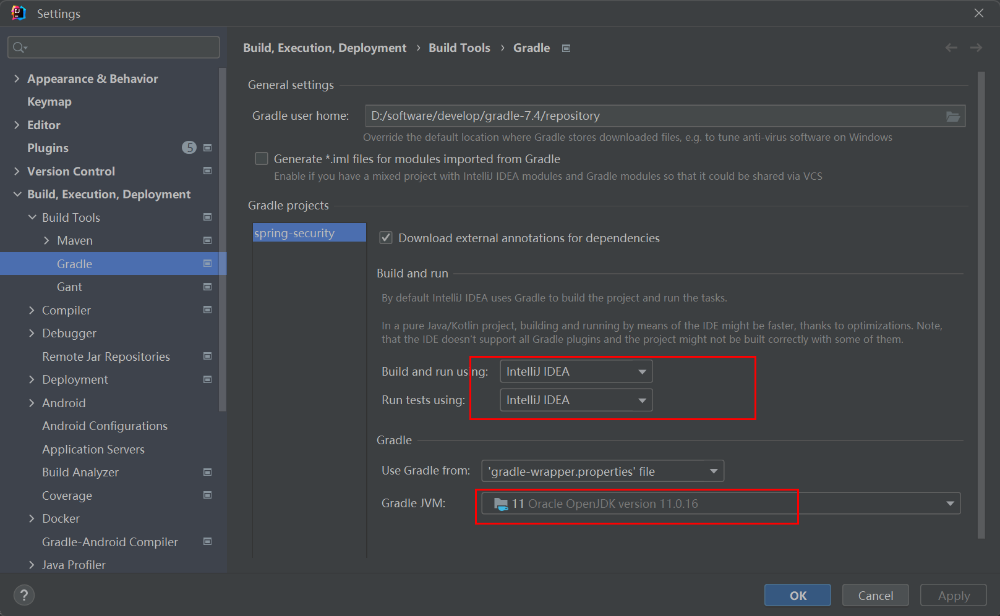
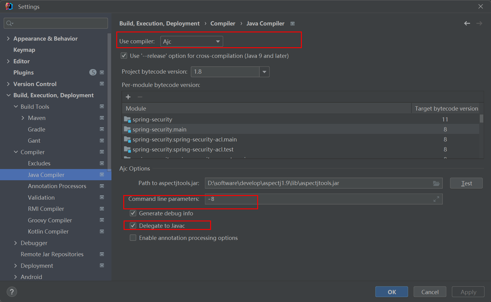
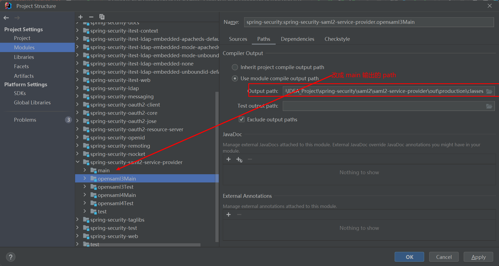
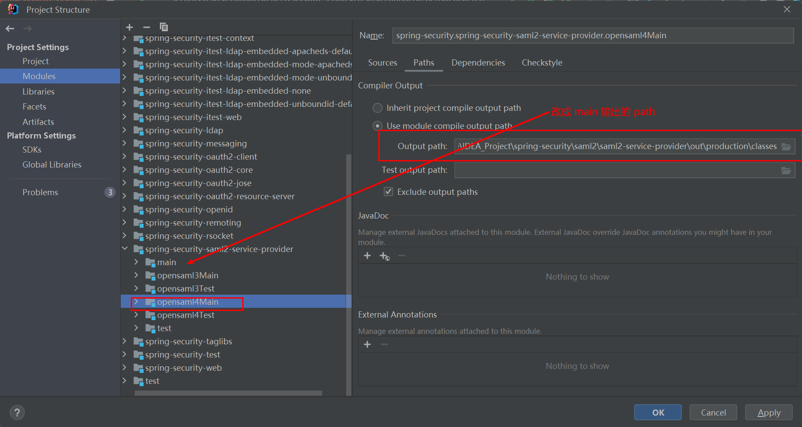

官方文档：https://docs.spring.io/spring-security/reference/5.8/

看完这个在看 spring-boot-starter-security

## IDEA 编译运行源码

[IDEA 配置 Ajc 可以看这里](https://github.com/haitaoss/spring-framework/blob/source-v5.3.10/note/spring-source-note.md#aspectj-compiler-%E9%85%8D%E7%BD%AE) 

