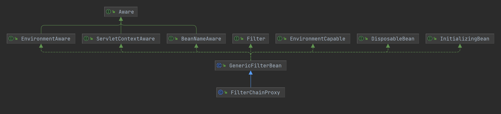
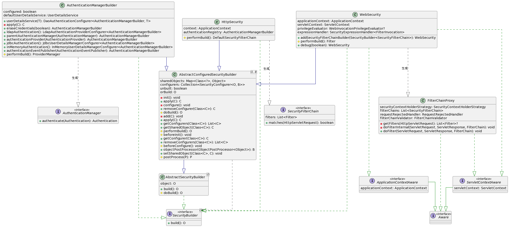
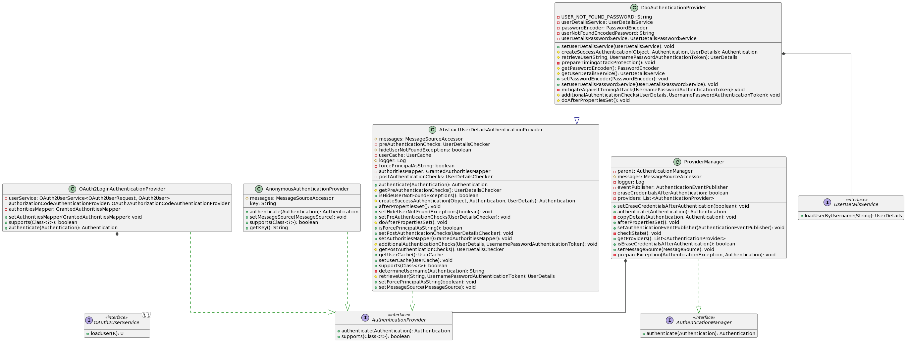

# 说明

Author: [haitaoss](https://github.com/haitaoss)

源码阅读仓库: [spring-security](https://github.com/haitaoss/spring-security)

参考资料和需要掌握的知识：

- [Spring Security 官方文档](https://docs.spring.io/spring-security/reference/5.8/)
- [官方示例代码：spring-security-samples](https://github.com/spring-projects/spring-security-samples/tree/5.8.x)
- [Spring 源码分析](https://github.com/haitaoss/spring-framework)

# Spring Security 介绍

Spring Security 是一个提供身份验证、授权和针对常见攻击的保护的框架。提供了对 Servlet 和 WebFlux 应用的支持。

Spring Security 通过使用标准 Servlet `Filter` 与 Servlet 容器集成。这意味着它适用于在 Servlet 容器中运行的任何应用程序。更具体地说，只要是 Servlet 应用程序就能使用 Spring Security，并不一定是 Spring 应用。

Spring Security 通过 `WebFilter` 实现对 Spring WebFlux  的支持。

**也就是说 Spring Security 只能在 Servlet应用 或 Spring WebFlux 应用中使用。**


## IDEA 编译运行源码


[IDEA 配置 Ajc 可以看这里](https://github.com/haitaoss/spring-framework/blob/source-v5.3.10/note/spring-source-note.md#aspectj-compiler-%E9%85%8D%E7%BD%AE)


## 核心的项目模块

> Core --- `spring-security-core.jar`

该模块包含核心身份验证和访问控制类和接口、远程处理支持和基本供应 API。任何使用 Spring Security 的应用程序都需要它。它支持独立应用程序、远程客户端、方法（服务层）安全和 JDBC 用户配置。

> Config --- `spring-security-config.jar`

该模块包含 security namespace 解析代码 和 Java 配置代码。如果您使用 Spring Security XML 命名空间进行配置或 Spring Security 的 Java 配置支持，则需要它。

> source-note-spring-security

验证 SpringSecurity 功能的demo

# 核心源码

## AbstractSecurityWebApplicationInitializer
```java
/**
 * AbstractSecurityWebApplicationInitializer 实现 WebApplicationInitializer 接口
 *		注册 DelegatingFilterProxy 到 servletContext 中，注册的 filterName 是 springSecurityFilterChain。
 *		DelegatingFilterProxy 是一个工具类，其 DelegatingFilterProxy.doFilter 是委托给 context.getName("springSecurityFilterChain",Filter.class) 执行
 *
 *		注：最终的目的是将请求交给 name是 springSecurityFilterChain 的Filter处理
 */
```
## @EnableWebSecurity

```java
@Retention(RetentionPolicy.RUNTIME)
@Target(ElementType.TYPE)
@Documented
/**
 * WebSecurityConfiguration：
 * 		- 会注册 FilterChainProxy , 这是 Security 接入 Servlet 容器的 Filter
 *
 * SpringWebMvcImportSelector：
 * 		- 扩展 HandlerMethodArgumentResolver，支持 @AuthenticationPrincipal、@CurrentSecurityContext、CsrfToken
 * 		- 注册 CsrfRequestDataValueProcessor 到容器中
 *
 * OAuth2ImportSelector：
 * 		- 注册 OAuth2AuthorizedClientArgumentResolver，支持 @RegisteredOAuth2AuthorizedClient
 *
 * HttpSecurityConfiguration：
 * 		- 注册 HttpSecurity , 是用来build得到 SecurityFilterChain 的工具
 */
@Import({WebSecurityConfiguration.class, SpringWebMvcImportSelector.class, OAuth2ImportSelector.class,
		HttpSecurityConfiguration.class})
/**
 * 会注册这两个类型的bean ObjectPostProcessor、AuthenticationConfiguration
 */
@EnableGlobalAuthentication
@Configuration
public @interface EnableWebSecurity {

	/**
	 * 为 true 会使用 DebugFilter 代理最终的 SecurityFilter，DebugFilter 的作用是
	 * doFilter 之前输出命中的 Filter 信息
	 */
	boolean debug() default false;

}
```

## WebSecurityConfiguration

[AuthenticationConfiguration 会注册默认的 ObjectPostProcessor](#AuthenticationConfiguration)

[HttpSecurityConfiguration 会注册 HttpSecurity](#HttpSecurityConfiguration)

```java
/**
 * 通过 @Autowired 注入：ObjectPostProcessor<Object>、List<SecurityFilterChain>、List<WebSecurityCustomizer>
 *      - ObjectPostProcessor<Object> 会由 AuthenticationConfiguration 注册
 *      - SecurityFilterChain 可由  HttpSecurity.build() 构造出
 *      - WebSecurityCustomizer 给用户定制 WebSecurity 的机会
 */
```
```java
/**
 *  实例化 WebSecurity
 *      1. 通过 objectPostProcessor 加工出 WebSecurity
 *          this.webSecurity = objectPostProcessor.postProcess(new WebSecurity(objectPostProcessor));
 *
 *      2. 从 BeanFactory 中获取 WebSecurityConfigurer 类型的bean 并排序
 *          List<SecurityConfigurer<Filter, WebSecurity>> webSecurityConfigurers = beanFactory.getBeansOfType(WebSecurityConfigurer.class);
 *          webSecurityConfigurers.sort(AnnotationAwareOrderComparator.INSTANCE); // 排序
 * 		    this.webSecurityConfigurers = webSecurityConfigurers; // 设置为属性
 *
 *      3. 将 webSecurityConfigurer 应用到 webSecurity
 *          for (SecurityConfigurer<Filter, WebSecurity> webSecurityConfigurer : webSecurityConfigurers) {
 *              this.webSecurity.apply(webSecurityConfigurer);
 *          }
 */
```
```java
/**
 * 通过 @Bean 注册 Filter（beanName 叫 springSecurityFilterChain）
 *    1. 校验 webSecurityConfigurer 和 securityFilterChains 只能设置一个
 *    2. 两个都没设置，就应用一个默认配置
 *          注册 WebSecurityConfigurerAdapter 这个 configurer。这是用来注册默认的 SecurityFilterChain，其默认是拦截所有请求。
 *          而认证逻辑 需要IOC容器中有且仅有一个 [ UserDetailsService | AuthenticationProvider] 类型的bean 才行。
 *
 *          WebSecurityConfigurerAdapter adapter = this.objectObjectPostProcessor
 * 					.postProcess(new WebSecurityConfigurerAdapter() { });
 *          this.webSecurity.apply(adapter);
 *
 *    3. 遍历 securityFilterChains 注册到 webSecurity 中
 *          for (SecurityFilterChain securityFilterChain : this.securityFilterChains) {
 * 	            // 添加 SecurityFilterChainBuilder
 * 	            this.webSecurity.addSecurityFilterChainBuilder(() -> securityFilterChain);
 *          }
 *
 *    4. 遍历 WebSecurityCustomizer 对 webSecurity 进行自定义
 *          for (WebSecurityCustomizer customizer : this.webSecurityCustomizers) {
 * 			    customizer.customize(this.webSecurity);
 *          }
 *
 *    5. 执行 build 得到 Filter
 *          return this.webSecurity.build();
 *
 *          5.1 回调 SecurityConfigurer#init
 *              比如 WebSecurityConfigurerAdapter ，其 init 方法就是为 webSecurity 添加 SecurityFilterChainBuilder
 *          5.2 回调 SecurityConfigurer#configure
 *          5.3 执行构建 webSecurity#performBuild
 *              - 遍历 webSecurity.securityFilterChainBuilders 执行 build 得到 List<SecurityFilterChain>
 *              - 构造出 new FilterChainProxy(securityFilterChains);
 */
```
```java
/**
 * 通过 @Bean 注册 DelegatingApplicationListener
 *     实现了 ApplicationListener<ApplicationEvent> 接口，
 *     会将收到的事件广播给适配的 ApplicationListener (DelegatingApplicationListener 内部的 ApplicationListener)
 *     比如
 *       {@link SessionManagementConfigurer#configure(HttpSecurityBuilder)} 会往 DelegatingApplicationListener 注册 ApplicationListener
 *       {@link AuthorizationFilter#doFilter(ServletRequest, ServletResponse, FilterChain)} 会发布事件
 *
 */
```
```java
/**
 * 通过 @Bean 注册 SecurityExpressionHandler<FilterInvocation>
 *   是一个工具类，是用来生成 SpEL 表达式的 RootObject 和 EvaluationContext
 *
 * 通过 @Bean 注册 WebInvocationPrivilegeEvaluator
 *   是一个工具类，可以在代码中使用 WebInvocationPrivilegeEvaluator 来实现声明式的权限校验
 *
 * 通过 @Bean 注册 BeanFactoryPostProcessor
 *   是 BeanFactoryPostProcessor 接口的实现类，用来给 BeanFactory 设置 类型转换的组件
 * 		    String ---> RSAPrivateKey
 * 		    String ---> RSAPublicKey
 */
```
## SpringWebMvcImportSelector

```java
/**
 * SpringWebMvcImportSelector
 *   会注册三个HandlerMethodArgumentResolver：
 *      - 处理有 @AuthenticationPrincipal 注解的参数
 *      - 处理有 @CurrentSecurityContext 注解的参数
 *      - 处理 CsrfToken 类型的参数
 */
```
## OAuth2ImportSelector

```java
/**
 * OAuth2ImportSelector
 *    注册 OAuth2AuthorizedClientArgumentResolver 处理有 @RegisteredOAuth2AuthorizedClient 注解的参数
 */
```

## HttpSecurityConfiguration

- 注册 HttpSecurity 到 BeanFactory 中可用来快速构造出 SecurityFilterChain
- [关联 AuthenticationConfiguration 中的 AuthenticationManager 作为兜底的 认证管理器](#HttpSecurityConfiguration)

```java
/**
 * 通过 @Autowired 注入：ObjectPostProcessor<Object>、AuthenticationConfiguration、SecurityContextHolderStrategy、ContentNegotiationStrategy
 *      - ObjectPostProcessor<Object> 会由 AuthenticationConfiguration 注册
 *      - AuthenticationConfiguration 使用 @EnableGlobalAuthentication 就会注册
 *      - SecurityContextHolderStrategy 是用于在一次请求上下文中共享认证信息。默认是 SecurityContextHolder.getContextHolderStrategy()
 *      - ContentNegotiationStrategy 默认是 HeaderContentNegotiationStrategy
 */
```

```java
@Bean(HTTPSECURITY_BEAN_NAME)
@Scope("prototype") // 原型的
HttpSecurity httpSecurity() throws Exception {
    /** 
     * 从 BeanFactory 中获取 PasswordEncoder 类型的bean 或者 使用 {@link PasswordEncoderFactories#createDelegatingPasswordEncoder()}
     */
    WebSecurityConfigurerAdapter.LazyPasswordEncoder passwordEncoder = new WebSecurityConfigurerAdapter.LazyPasswordEncoder(
            this.context);
    // 是用来实现认证逻辑的，密码的匹配是依赖 passwordEncoder 实现的
    AuthenticationManagerBuilder authenticationBuilder = new WebSecurityConfigurerAdapter.DefaultPasswordEncoderAuthenticationManagerBuilder(
            this.objectPostProcessor, passwordEncoder);
    /**
     * 设置 parentAuthenticationManager 其目的是指定兜底的认证方式。
     *
     * 默认会通过 authenticationConfiguration.getAuthenticationManager() 得到，特点是根据容器中存在 UserDetailsService 或者 AuthenticationProvider 类型的bean就设置默认的 AuthenticationProvider
     * 		{@link AuthenticationConfiguration#getAuthenticationManager()}
     */
    authenticationBuilder.parentAuthenticationManager(authenticationManager());
    /**
     * 从IOC容器中获取 AuthenticationEventPublisher 没有就默认用 AuthenticationEventPublisher
     */
    authenticationBuilder.authenticationEventPublisher(getAuthenticationEventPublisher());
    /**
     * new 一个 HttpSecurity
     *
     * 会设置 setSharedObject(AuthenticationManagerBuilder.class, authenticationBuilder);
     */
    HttpSecurity http = new HttpSecurity(this.objectPostProcessor, authenticationBuilder, createSharedObjects());
    // 是用来设置、清空 securityContextHolderStrategy 中记录的 context
    WebAsyncManagerIntegrationFilter webAsyncManagerIntegrationFilter = new WebAsyncManagerIntegrationFilter();
    webAsyncManagerIntegrationFilter.setSecurityContextHolderStrategy(this.securityContextHolderStrategy);
    // @formatter:off
    http
        /**
         * 会添加 CsrfConfigurer 它的作用是添加 CsrfFilter
         * 		{@link CsrfConfigurer#configure( HttpSecurityBuilder)}
         */
        .csrf(withDefaults())
        /**
         * webAsyncManagerIntegrationFilter 作为默认的 filter
         *
         * 注：filter 的类型是有限定的，必须是内置的类型，否则会报错。
         * 	内置的Filter类型看这里 {@link org.springframework.security.config.annotation.web.builders.FilterOrderRegistration#FilterOrderRegistration()}
         */
        .addFilter(webAsyncManagerIntegrationFilter)
        /**
         * 会添加 ExceptionHandlingConfigurer 它的作用是添加 ExceptionTranslationFilter
         * 		{@link ExceptionHandlingConfigurer#configure( HttpSecurityBuilder)}
         */
        .exceptionHandling(withDefaults())
        /**
         * 会添加 HeadersConfigurer 它的作用是添加 HeaderWriterFilter
         * 		{@link HeadersConfigurer#configure( HttpSecurityBuilder)}
         */
        .headers(withDefaults())
        /**
         * 会添加 SessionManagementConfigurer 它的作用是添加 SessionManagementFilter
         * 		{@link SessionManagementConfigurer#init( HttpSecurityBuilder)}
         * 		{@link SessionManagementConfigurer#configure( HttpSecurityBuilder)}
         */
        .sessionManagement(withDefaults())
        /**
         * 会添加 SecurityContextConfigurer 它的作用是添加 SecurityContextHolderFilter 或者 SecurityContextPersistenceFilter
         * 		{@link SecurityContextConfigurer#configure( HttpSecurityBuilder)}
         */
        .securityContext(withDefaults())
        /**
         * 会添加 RequestCacheConfigurer 它的作用是添加 RequestCacheAwareFilter
         * 		{@link RequestCacheConfigurer#init( HttpSecurityBuilder)}
         * 		{@link RequestCacheConfigurer#configure( HttpSecurityBuilder)}
         */
        .requestCache(withDefaults())
        /**
         * 会添加 AnonymousConfigurer 它的作用是添加 AnonymousAuthenticationFilter
         * 		{@link AnonymousConfigurer#init( HttpSecurityBuilder)}
         *		{@link AnonymousConfigurer#configure( HttpSecurityBuilder)}
         *
         * Tips: 这个很关键，默认会设置 AnonymousAuthenticationProvider 是用来实现认证的，这是最简单的认证方式。
         * 		可以理解成没有认证，因为认证的信息是由 AnonymousAuthenticationFilter 生成的，肯定能认证通过。
         */
        .anonymous(withDefaults())
        /**
         * 会添加 ServletApiConfigurer 它的作用是添加 SecurityContextHolderAwareRequestFilter
         * 		{@link ServletApiConfigurer#configure( HttpSecurityBuilder)}
         */
        .servletApi(withDefaults())
        /**
         * 会添加 DefaultLoginPageConfigurer 它的作用是添加 DefaultLoginPageGeneratingFilter、DefaultLogoutPageGeneratingFilter
         * 		{@link DefaultLoginPageConfigurer#init( HttpSecurityBuilder)}
         * 		{@link DefaultLoginPageConfigurer#configure( HttpSecurityBuilder)}
         */
        .apply(new DefaultLoginPageConfigurer<>());
    /**
     * 会添加 LogoutConfigurer 它的作用是添加 LogoutFilter
     * 		{@link LogoutConfigurer#init( HttpSecurityBuilder)}
     * 		{@link LogoutConfigurer#configure( HttpSecurityBuilder)}
     */
    http.logout(withDefaults());
    // @formatter:on
    /**
     * 读取 META-INF/spring.factories 文件 key是 `AbstractHttpConfigurer.class.getName()`
     * 添加到 http 中
     */
    applyDefaultConfigurers(http);
    return http;
}
```

## @EnableGlobalAuthentication

```java
@Retention(RetentionPolicy.RUNTIME)
@Target(ElementType.TYPE)
@Documented
/** 
 * AuthenticationConfiguration:
 *  - 会注册 AutowireBeanFactoryObjectPostProcessor、AuthenticationManagerBuilder、GlobalAuthenticationConfigurerAdapter
 */
@Import(AuthenticationConfiguration.class)
@Configuration
public @interface EnableGlobalAuthentication {}
```

## AuthenticationConfiguration

1. 注册 AutowireBeanFactoryObjectPostProcessor
2. 可以注册 GlobalAuthenticationConfigurerAdapter 用来配置 AuthenticationManagerBuilder
3. 注册 AuthenticationManagerBuilder，用来生成兜底的 AuthenticationManager

```java
/**
 * 类上标注了 @Import(ObjectPostProcessorConfiguration.class) 而 ObjectPostProcessorConfiguration 会注册 AutowireBeanFactoryObjectPostProcessor 到容器中
 * 通过 @Autowired 注入：List<GlobalAuthenticationConfigurerAdapter>、ObjectPostProcessor<Object>
 *      - GlobalAuthenticationConfigurerAdapter
 *      - ObjectPostProcessor<Object> 会由 AuthenticationConfiguration 注册
 */
```
```java
/**
 * 通过 @Bean 注册三个 GlobalAuthenticationConfigurerAdapter：
 *  - EnableGlobalAuthenticationAutowiredConfigurer：它的职责是 获取有 @EnableGlobalAuthentication 注解的bean，会进行 getBean 将bean实例化出来，也就是提前初始化
 *
 *  - InitializeUserDetailsBeanManagerConfigurer：它的职责是为  AuthenticationManagerBuilder 添加 InitializeUserDetailsManagerConfigurer
 *      这个 configurer 功能是若IOC容器中只有一个 UserDetailsService 类型的bean，就构造一个 DaoAuthenticationProvider 设置给 AuthenticationManagerBuilder
 *
 *  - InitializeAuthenticationProviderBeanManagerConfigurer：它的职责是为  AuthenticationManagerBuilder 添加 InitializeAuthenticationProviderManagerConfigurer
 *      这个 configurer 的功能是若IOC容器中只有一个 AuthenticationProvider 类型的bean，就将其设置给 AuthenticationManagerBuilder
 */
```
```java
@Bean
public AuthenticationManagerBuilder authenticationManagerBuilder(ObjectPostProcessor<Object> objectPostProcessor,
        ApplicationContext context) {
    /**
     * 特点是从 BeanFactory 中获取 PasswordEncoder 类型的bean 或者 使用 {@link PasswordEncoderFactories#createDelegatingPasswordEncoder()}
     */
    LazyPasswordEncoder defaultPasswordEncoder = new LazyPasswordEncoder(context);
    /**
     * 尝试从IOC容器中获取 AuthenticationEventPublisher，拿不到就new一个默认的
     */
    AuthenticationEventPublisher authenticationEventPublisher = getAuthenticationEventPublisher(context);
    // 构造出 DefaultPasswordEncoderAuthenticationManagerBuilder
    DefaultPasswordEncoderAuthenticationManagerBuilder result = new DefaultPasswordEncoderAuthenticationManagerBuilder(
            objectPostProcessor, defaultPasswordEncoder);
    if (authenticationEventPublisher != null) {
        // 设置事件发布器
        result.authenticationEventPublisher(authenticationEventPublisher);
    }
    return result;
}
```

## AuthenticationConfiguration#getAuthenticationManager

```java
public AuthenticationManager getAuthenticationManager() throws Exception {
    // 已经初始化了
    if (this.authenticationManagerInitialized) {
        // 直接返回
        return this.authenticationManager;
    }
    /**
     * 从IOC容器中获取 AuthenticationManagerBuilder
     * Tips：本类的 {@link #authenticationManagerBuilder} 方法注册了
     */
    AuthenticationManagerBuilder authBuilder = this.applicationContext.getBean(AuthenticationManagerBuilder.class);
    // 默认是false
    if (this.buildingAuthenticationManager.getAndSet(true)) {
        return new AuthenticationManagerDelegator(authBuilder);
    }
    /**
     * 遍历 globalAuthConfigurers
     *
     * Tips：
     * 	1. globalAuthConfigurers 是通过依赖注入得到的
     * 	2. 本类的 {@link #enableGlobalAuthenticationAutowiredConfigurer}、
     * 		{@link #initializeAuthenticationProviderBeanManagerConfigurer}、
     * 		{@link #initializeUserDetailsBeanManagerConfigurer} 方法注册了。
     *
     * Tips：
     * 		initializeAuthenticationProviderBeanManagerConfigurer 先执行，会判断IOC容器中存在 AuthenticationProvider 就设置给 authBuilder ，
     * 		initializeUserDetailsBeanManagerConfigurer 会判断IOC容器中存在 UserDetailsService 就设置 DaoAuthenticationProvider 给 authBuilder。
     *		不会设置两个，因为设置之前会判断是否有 {@link AuthenticationManagerBuilder#authenticationProviders} ,所以可以理解成两者是互斥的
     */
    for (GlobalAuthenticationConfigurerAdapter config : this.globalAuthConfigurers) {
        // 添加 config
        authBuilder.apply(config);
    }
    /**
     * 生成实例。最关键是回调注册的 config
     *
     * {@link AbstractConfiguredSecurityBuilder#doBuild()}
     * 		1. 回调 GlobalAuthenticationConfigurerAdapter#init
     * 		2. 回调 GlobalAuthenticationConfigurerAdapter#configure
     * 		3. 构造出实例对象
     */
    this.authenticationManager = authBuilder.build();
    // 为空
    if (this.authenticationManager == null) {
        // 尝试从容器中获取 AuthenticationManager 类型的bean
        this.authenticationManager = getAuthenticationManagerBean();
    }
    // 标记为 true
    this.authenticationManagerInitialized = true;
    return this.authenticationManager;
}
```

## @EnableMethodSecurity

```java
@Retention(RetentionPolicy.RUNTIME)
@Target(ElementType.TYPE)
@Documented
/**
 * 默认是注册 InfrastructureAdvisorAutoProxyCreator，是用来实现动态代理AOP的
 * 然后注册各种 Advisor ，是用来指定那些bean需要AOP、AOP的增强逻辑是啥
 */
@Import(MethodSecuritySelector.class)
@Configuration
public @interface EnableMethodSecurity {
	boolean prePostEnabled() default true;
	boolean securedEnabled() default false;
	boolean jsr250Enabled() default false;
	boolean proxyTargetClass() default false;
	AdviceMode mode() default AdviceMode.PROXY;
}
```

## MethodSecuritySelector

```java
final class MethodSecuritySelector implements ImportSelector {

	private final ImportSelector autoProxy = new AutoProxyRegistrarSelector();

	@Override
	public String[] selectImports(@NonNull AnnotationMetadata importMetadata) {
		// 没有 @EnableMethodSecurity
		if (!importMetadata.hasAnnotation(EnableMethodSecurity.class.getName())) {
			// 返回空数组，表示啥都不注册到 BeanFactory 中，这是Spring的知识
			return new String[0];
		}
		EnableMethodSecurity annotation = importMetadata.getAnnotations().get(EnableMethodSecurity.class).synthesize();
		/**
		 * 获取默认要注入的配置类 {@link AutoProxyRegistrarSelector#selectImports(AdviceMode)}
		 * 默认是注册这个 AutoProxyRegistrar 它的作用是会注册 InfrastructureAdvisorAutoProxyCreator 到BeanFactory中，
		 * 其作用是根据从 BeanFactory 中获取 @Role(BeanDefinition.ROLE_INFRASTRUCTURE) 的 Advisor 类型的bean，完成动态代理实现的AOP
		 */
		List<String> imports = new ArrayList<>(Arrays.asList(this.autoProxy.selectImports(importMetadata)));
		// 根据注解属性值决定是否添加配置类
		if (annotation.prePostEnabled()) {
			/**
			 * 默认是启用的。
			 *
			 * 其实就是注册4个 Advisor：
			 * 	- 有 @PreAuthorize 的bean（方法或者类上有）就为bean创建代理对象，增强逻辑是：先鉴权在执行方法
			 * 	- 有 @PostAuthorize 的bean（方法或者类上有）就为bean创建代理对象，增强逻辑是：先执行方法在鉴权
			 * 	- 有 @PreFilter 的bean（方法或者类上有）就为bean创建代理对象，增强逻辑是：对方法的参数列表做修改
			 * 	- 有 @PostFilter 的bean（方法或者类上有）就为bean创建代理对象，增强逻辑是：对方法的返回值做修改
			 */
			imports.add(PrePostMethodSecurityConfiguration.class.getName());
		}
		if (annotation.securedEnabled()) {
			// 同上。对 @Secured 先鉴权在执行方法
			imports.add(SecuredMethodSecurityConfiguration.class.getName());
		}
		if (annotation.jsr250Enabled()) {
			// 同上 对 @RolesAllowed、@DenyAll、@PermitAll 先鉴权在执行方法
			imports.add(Jsr250MethodSecurityConfiguration.class.getName());
		}
		return imports.toArray(new String[0]);
	}
}
```


# 重要的类

## FilterChainProxy



FilterChainProxy 是一个 Filter ，默认是将 FilterChainProxy 注册到 Web容器中，从而将 Spring Security 的认证鉴权逻辑 应用到 Web应用中。

FilterChainProxy 有一个非常重要的属性 `filterChains`，可由 [HttpSecurity](#HttpSecurityConfiguration) 方便的构造出来 [SecurityFilterChain](#DefaultSecurityFilterChain)

```java
// 伪代码
public class FilterChainProxy extends GenericFilterBean {
    private List<SecurityFilterChain> filterChains;

    private void doFilterInternal(ServletRequest request, ServletResponse response, FilterChain chain)
            throws IOException, ServletException {
        /**
         * 遍历 SecurityFilterChain , SecurityFilterChain.matches(request) 匹配就返回 SecurityFilterChain.getFilters()
         * 所以说 List<SecurityFilterChain> 的先后顺序很重要，先匹配就会被使用。
         */
        List<Filter> filters = null;
        for (SecurityFilterChain securityFilterChain : this.filterChains) {
            // 匹配
            if (securityFilterChain.matches(request)) {
                // 返回
                filters = securityFilterChain.getFilters();
            }
        }
        // 没有找到
        if (filters == null || filters.size() == 0) {
            // 直接放行
            chain.doFilter(request, response);
            return;
        }

        // chain + filters 装饰成 VirtualFilterChain
        VirtualFilterChain virtualFilterChain = new VirtualFilterChain(request, chain, filters);
        // 执行。先执行 filters 在执行 chain
        virtualFilterChain.doFilter(request, response);
    }
}
```

## WebSecurity & HttpSecurity & AuthenticationManagerBuilder



```java
public abstract class AbstractConfiguredSecurityBuilder<O, B extends SecurityBuilder<O>>
        extends AbstractSecurityBuilder<O> {
    @Override
    protected final O doBuild() throws Exception {
        synchronized (this.configurers) {
            // 初始化
            this.buildState = BuildState.INITIALIZING;
            // 预留的模板方法
            beforeInit();
            /**
             * 遍历设置的 List<SecurityConfigurer> ,回调 {@link SecurityConfigurer#init(SecurityBuilder)} 用来配置 this
             */
            init();
            this.buildState = BuildState.CONFIGURING;
            /**
             * 预留的模板方法
             *
             * {@link HttpSecurity#beforeConfigure()}
             * 		设置 setSharedObject(AuthenticationManager.class, this.authenticationManager);
             * 		这个很重要，AuthenticationManager 是用来实现认证、鉴权的
             */
            beforeConfigure();
            /**
             * 遍历设置的 List<SecurityConfigurer> ,回调 {@link SecurityConfigurer#configure(SecurityBuilder)} 用来配置 this
             */
            configure();
            this.buildState = BuildState.BUILDING;
            /**
             * 生成实例。主要是有这三个子类：
             *    {@link HttpSecurity#performBuild()}
             * 			new DefaultSecurityFilterChain(this.requestMatcher, sortedFilters);
             *    {@link WebSecurity#performBuild()}
             *			new FilterChainProxy(List<SecurityFilterChain>);
             *    {@link AuthenticationManagerBuilder#performBuild()}
             * 			new ProviderManager(this.authenticationProviders,this.parentAuthenticationManager);
             */
            O result = performBuild();
            this.buildState = BuildState.BUILT;
            return result;
        }
    }
}
```

### HttpSecurity#performBuild

```java
public final class HttpSecurity extends AbstractConfiguredSecurityBuilder<DefaultSecurityFilterChain, HttpSecurity>
        implements SecurityBuilder<DefaultSecurityFilterChain>, HttpSecurityBuilder<HttpSecurity> {

    @Override
    protected DefaultSecurityFilterChain performBuild() {
        // 获取 ExpressionUrlAuthorizationConfigurer 类型的 configurer
        ExpressionUrlAuthorizationConfigurer<?> expressionConfigurer = getConfigurer(
                ExpressionUrlAuthorizationConfigurer.class);
        // 获取 AuthorizeHttpRequestsConfigurer 类型的 configurer
        AuthorizeHttpRequestsConfigurer<?> httpConfigurer = getConfigurer(AuthorizeHttpRequestsConfigurer.class);
        // 设置了一个
        boolean oneConfigurerPresent = expressionConfigurer == null ^ httpConfigurer == null;
        // expressionConfigurer 和 httpConfigurer 都设置了 就报错
        Assert.state((expressionConfigurer == null && httpConfigurer == null) || oneConfigurerPresent,"error...");
        /**
         * 排序。这一点很关键,决定Filter执行的先后顺序
         */
        this.filters.sort(OrderComparator.INSTANCE);
        List<Filter> sortedFilters = new ArrayList<>(this.filters.size());
        for (Filter filter : this.filters) {
            //	filters 记录的时候是 OrderedFilter 类型，所以这里强转一下
            sortedFilters.add(((OrderedFilter) filter).filter);
        }
        /**
         * 构造出 DefaultSecurityFilterChain
         * requestMatcher 默认是 AnyRequestMatcher.INSTANCE，其 {@link AnyRequestMatcher#matches(HttpServletRequest)} 一直返回 true
         *
         * 可以通过这些方法修改默认的值
         * 	- {@link #antMatcher}
         * 	- {@link #mvcMatcher}
         */
        return new DefaultSecurityFilterChain(this.requestMatcher, sortedFilters);
    }
}
```

### WebSecurity#performBuild

```java
public final class WebSecurity extends AbstractConfiguredSecurityBuilder<Filter, WebSecurity>
        implements SecurityBuilder<Filter>, ApplicationContextAware, ServletContextAware {
    @Override
    protected Filter performBuild() throws Exception {
        // 校验 securityFilterChainBuilders 不能是空
        Assert.state(!this.securityFilterChainBuilders.isEmpty(),"error");
        int chainSize = this.ignoredRequests.size() + this.securityFilterChainBuilders.size();
        List<SecurityFilterChain> securityFilterChains = new ArrayList<>(chainSize);
        List<RequestMatcherEntry<List<WebInvocationPrivilegeEvaluator>>> requestMatcherPrivilegeEvaluatorsEntries = new ArrayList<>();
        // 遍历 ignoredRequests
        for (RequestMatcher ignoredRequest : this.ignoredRequests) {
            // 装饰成 DefaultSecurityFilterChain
            SecurityFilterChain securityFilterChain = new DefaultSecurityFilterChain(ignoredRequest);
            // 记录起来
            securityFilterChains.add(securityFilterChain);
            // 根据 securityFilterChain.getFilters() 筛选出 FilterSecurityInterceptor、AuthorizationFilter 用来构造 RequestMatcherEntry
            requestMatcherPrivilegeEvaluatorsEntries
                    .add(getRequestMatcherPrivilegeEvaluatorsEntry(securityFilterChain));
        }
        // 遍历 securityFilterChainBuilders
        for (SecurityBuilder<? extends SecurityFilterChain> securityFilterChainBuilder : this.securityFilterChainBuilders) {
            // build
            SecurityFilterChain securityFilterChain = securityFilterChainBuilder.build();
            // 记录起来
            securityFilterChains.add(securityFilterChain);
            // 根据 securityFilterChain.getFilters() 筛选出 FilterSecurityInterceptor、AuthorizationFilter 用来构造 RequestMatcherEntry
            requestMatcherPrivilegeEvaluatorsEntries
                    .add(getRequestMatcherPrivilegeEvaluatorsEntry(securityFilterChain));
        }
        if (this.privilegeEvaluator == null) {
            // 默认用这个
            this.privilegeEvaluator = new RequestMatcherDelegatingWebInvocationPrivilegeEvaluator(
                    requestMatcherPrivilegeEvaluatorsEntries);
        }
        // 装饰成 FilterChainProxy
        FilterChainProxy filterChainProxy = new FilterChainProxy(securityFilterChains);
        if (this.httpFirewall != null) {
            filterChainProxy.setFirewall(this.httpFirewall);
        }
        if (this.requestRejectedHandler != null) {
            filterChainProxy.setRequestRejectedHandler(this.requestRejectedHandler);
        }
        // 回调方法，默认是啥都没干
        filterChainProxy.afterPropertiesSet();

        Filter result = filterChainProxy;
        // 开启了 debug
        if (this.debugEnabled) {
            /**
             * 装饰成 DebugFilter。
             * 作用：先打印 info 日志输出命中的 Filter 信息，再委托给 filterChainProxy 执行
             */
            result = new DebugFilter(filterChainProxy);
        }
        // 回调方法
        this.postBuildAction.run();
        return result;
    }
}
```

### AuthenticationManagerBuilder#performBuild

```java
public class AuthenticationManagerBuilder
        extends AbstractConfiguredSecurityBuilder<AuthenticationManager, AuthenticationManagerBuilder>
        implements ProviderManagerBuilder<AuthenticationManagerBuilder> {
    @Override
    protected ProviderManager performBuild() throws Exception {
        // parentAuthenticationManager 和 authenticationProviders 都是空
        if (!isConfigured()) {
            // 返回 null
            return null;
        }
        // 依赖 authenticationProviders + parentAuthenticationManager 构造出 ProviderManager           
        ProviderManager providerManager = new ProviderManager(this.authenticationProviders,
                this.parentAuthenticationManager);
        if (this.eraseCredentials != null) {
            providerManager.setEraseCredentialsAfterAuthentication(this.eraseCredentials);
        }
        if (this.eventPublisher != null) {
            // 认证成功、失败 会使用 eventPublisher 发布事件             
            providerManager.setAuthenticationEventPublisher(this.eventPublisher);
        }
        // 使用 ObjectPostProcessor 加工
        providerManager = postProcess(providerManager);
        return providerManager;
    }
}
```

## DefaultSecurityFilterChain

DefaultSecurityFilterChain 是 SecurityFilterChain 的实现类，由 `RequestMatcher + List<Filter>` 组成。[FilterChainProxy](#FilterChainProxy) 会通过 `SecurityFilterChain#matches 得到唯一的 SecurityFilterChain` 然后将执行 `SecurityFilterChain#getFilters` 中的所有 Filter

```java
public interface SecurityFilterChain {
	boolean matches(HttpServletRequest request);
	List<Filter> getFilters();
}

public final class DefaultSecurityFilterChain implements SecurityFilterChain {

	private final RequestMatcher requestMatcher;

	private final List<Filter> filters;
    
	@Override
	public List<Filter> getFilters() {
		return this.filters;
	}

	@Override
	public boolean matches(HttpServletRequest request) {
		return this.requestMatcher.matches(request);
	}

}
```

## ProviderManager

> [AbstractAuthenticationProcessingFilter](#AbstractAuthenticationProcessingFilter ) 依赖 AuthenticationManager 来完成认证逻辑。
>
> ProviderManager 是 AuthenticationManager 默认会使用的实现类，它聚合 `List<AuthenticationProvider>` 由 AuthenticationProvider 完成具体的认证逻辑。	
>
> 常见的 AuthenticationProvider 的实现类有 DaoAuthenticationProvider 和 OAuth2LoginAuthenticationProvider。
>
> DaoAuthenticationProvider 会依赖 UserDetailsService 获取真正的用户信息 然后与登录的用户进行密码匹配。
>
> OAuth2LoginAuthenticationProvider 会依赖 OAuth2UserService 获取真正的用户信息。



```java
public class ProviderManager implements AuthenticationManager, MessageSourceAware, InitializingBean {
    @Override
    public Authentication authenticate(Authentication authentication) {
        // 认证的类型
        Class<? extends Authentication> toTest = authentication.getClass();
      
        // 遍历 AuthenticationProvider
        for (AuthenticationProvider provider : getProviders()) {
            // 不支持
            if (!provider.supports(toTest)) {
                // 跳过
                continue;
            }

            try {
                /**
                 * 使用 provider 进行认证
                 *   {@link AbstractUserDetailsAuthenticationProvider#authenticate(Authentication)}
                 */
                result = provider.authenticate(authentication);
                if (result != null) {
                    // 将 authentication 的内容拷贝给 result
                    copyDetails(authentication, result);
                    break;
                }
            } catch (AccountStatusException | InternalAuthenticationServiceException ex) {
                // 发布事件
                prepareException(ex, authentication);
                // 抛出异常                
                throw ex;
            } catch (AuthenticationException ex) {
                lastException = ex;
            }
        }
        // 没有认证结果 且 存在parent
        if (result == null && this.parent != null) {
            try {
                /**
                 * 委托给 parent 进行认证。可以理解成递归，因为 parent 默认也是 ProviderManager 类型的
                 */
                parentResult = this.parent.authenticate(authentication);
                result = parentResult;
            } catch (AuthenticationException ex) {
                parentException = ex;
                lastException = ex;
            }
        }
        if (result != null) {
            // parentResult == null 才发布，因为如果是通过 parent 获取的认证信息，parent 会发布事件
            if (parentResult == null) {
                // 发布事件
                this.eventPublisher.publishAuthenticationSuccess(result);
            }

            return result;
        }
                
        // 抛出异常
        throw lastException;
    }

}
```

## AuthenticationProvider

### DaoAuthenticationProvider

```java
public class DaoAuthenticationProvider extends AbstractUserDetailsAuthenticationProvider {

    private PasswordEncoder passwordEncoder; // 用于匹配用户输入的密码 与 真实用户信息记录的密码

    private UserDetailsService userDetailsService; // 用于获取真实的用户信息

    public DaoAuthenticationProvider() {
        setPasswordEncoder(PasswordEncoderFactories.createDelegatingPasswordEncoder());
    }

    @Override
    @SuppressWarnings("deprecation")
    protected void additionalAuthenticationChecks(UserDetails userDetails,
                                                  UsernamePasswordAuthenticationToken authentication) throws AuthenticationException {
        // 凭证为空
        if (authentication.getCredentials() == null) {
            // 抛出异常
            throw new BadCredentialsException("error");
        }
        // 获取凭证
        String presentedPassword = authentication.getCredentials().toString();
        // 使用 passwordEncoder 校验凭证不一致
        if (!this.passwordEncoder.matches(presentedPassword, userDetails.getPassword())) {
            // 抛出异常
            throw new BadCredentialsException("error");
        }
    }

    @Override
    protected final UserDetails retrieveUser(String username, UsernamePasswordAuthenticationToken authentication)
            throws AuthenticationException {
        try {
            // 通过 UserDetailsService 加载 User
            UserDetails loadedUser = this.getUserDetailsService().loadUserByUsername(username);
            // 没加载到
            if (loadedUser == null) {
                // 抛出异常
                throw new InternalAuthenticationServiceException("error");
            }
            return loadedUser;
        } catch (Exception ex) {
            throw new InternalAuthenticationServiceException(ex.getMessage(), ex);
        }
    }

}
```


```java
public abstract class AbstractUserDetailsAuthenticationProvider
        implements AuthenticationProvider, InitializingBean, MessageSourceAware {
    @Override
    public Authentication authenticate(Authentication authentication) {
        /**
         * authentication 必须是 UsernamePasswordAuthenticationToken 类型的.
         * 比如: UsernamePasswordAuthenticationFilter 构造的 Authentication 就是 UsernamePasswordAuthenticationToken 类型的
         */
        Assert.isInstanceOf(UsernamePasswordAuthenticationToken.class, authentication, "error");
        // 提取出 username
        String username = determineUsername(authentication);
        boolean cacheWasUsed = true;
        // 尝试从缓存中获取
        UserDetails user = this.userCache.getUserFromCache(username);
        if (user == null) {
            // 标记没有缓存
            cacheWasUsed = false;
            try {
                /**
                 * 根据 username 检索出 user，这是真正的用户信息
                 *        {@link DaoAuthenticationProvider#retrieveUser(String, UsernamePasswordAuthenticationToken)}
                 *        {@link UserDetailsService#loadUserByUsername(String)}
                 */
                user = retrieveUser(username, (UsernamePasswordAuthenticationToken) authentication);
            } catch (UsernameNotFoundException ex) {
                this.logger.debug("Failed to find user '" + username + "'");
                if (!this.hideUserNotFoundExceptions) {
                    throw ex;
                }
                throw new BadCredentialsException(this.messages
                        .getMessage("AbstractUserDetailsAuthenticationProvider.badCredentials", "Bad credentials"));
            }
            // 为空就报错。说明用户名根本就不对
            Assert.notNull(user, "retrieveUser returned null - a violation of the interface contract");
        }
        try {
            /**
             * 前置认证检查。默认是检验 凭证不是过期的
             *    {@link DefaultPostAuthenticationChecks#check(org.springframework.security.core.userdetails.UserDetails)}
             */
            this.preAuthenticationChecks.check(user);
            /**
             * 进行附加检查。这是抽象方法看具体的子类是如何写的。
             *
             * 比如：{@link DaoAuthenticationProvider#additionalAuthenticationChecks(org.springframework.security.core.userdetails.UserDetails, org.springframework.security.authentication.UsernamePasswordAuthenticationToken)}
             * 			1.  authentication.getCredentials() 不能是空
             * 			2. 	使用 PasswordEncoder 校验 user.getPassword() 和 authentication.getCredentials() 是一致的
             */
            additionalAuthenticationChecks(user, (UsernamePasswordAuthenticationToken) authentication);
        } catch (AuthenticationException ex) {
            // 不是缓存的值
            if (!cacheWasUsed) {
                // 直接抛出异常
                throw ex;
            }
            // 缓存的值校验错误，那就获取最新的信息 重新进行检查
            // There was a problem, so try again after checking
            // we're using latest data (i.e. not from the cache)
            cacheWasUsed = false;
            // 检索 user
            user = retrieveUser(username, (UsernamePasswordAuthenticationToken) authentication);
            // 前置认证检查
            this.preAuthenticationChecks.check(user);
            additionalAuthenticationChecks(user, (UsernamePasswordAuthenticationToken) authentication);
        }
        // 后置认证检查
        this.postAuthenticationChecks.check(user);
        // 不是缓存
        if (!cacheWasUsed) {
            // 设置缓存
            this.userCache.putUserInCache(user);
        }
        Object principalToReturn = user;
        if (this.forcePrincipalAsString) {
            principalToReturn = user.getUsername();
        }
        // 装饰成 Authentication
        return createSuccessAuthentication(principalToReturn, authentication, user);
    }
}
```

### OAuth2LoginAuthenticationProvider 

```java
public class OAuth2LoginAuthenticationProvider implements AuthenticationProvider {

    private final OAuth2AuthorizationCodeAuthenticationProvider authorizationCodeAuthenticationProvider;

    private final OAuth2UserService<OAuth2UserRequest, OAuth2User> userService;
    
    @Override
    public Authentication authenticate(Authentication authentication) {
        OAuth2LoginAuthenticationToken loginAuthenticationToken = (OAuth2LoginAuthenticationToken) authentication;
        OAuth2AuthorizationCodeAuthenticationToken authorizationCodeAuthenticationToken;
        try {
            // 获取访问令牌
            authorizationCodeAuthenticationToken = (OAuth2AuthorizationCodeAuthenticationToken) this.authorizationCodeAuthenticationProvider
                    /**
                     * {@link OAuth2AuthorizationCodeAuthenticationProvider#authenticate(Authentication)}
                     */
                    .authenticate(new OAuth2AuthorizationCodeAuthenticationToken(
                            loginAuthenticationToken.getClientRegistration(),
                            loginAuthenticationToken.getAuthorizationExchange()));
        } catch (OAuth2AuthorizationException ex) {
            OAuth2Error oauth2Error = ex.getError();
            throw new OAuth2AuthenticationException(oauth2Error, oauth2Error.toString(), ex);
        }
        // 拿到访问令牌
        OAuth2AccessToken accessToken = authorizationCodeAuthenticationToken.getAccessToken();
        Map<String, Object> additionalParameters = authorizationCodeAuthenticationToken.getAdditionalParameters();
        /**
         * 获取用户信息
         *    {@link DefaultOAuth2UserService#loadUser(OAuth2UserRequest)}
         * 	其实就是根据设置的 用户个人信息url + 访问令牌 请求url得到用户基本信息 构造出 OAuth2User
         */
        OAuth2User oauth2User = this.userService.loadUser(new OAuth2UserRequest(
                loginAuthenticationToken.getClientRegistration(), accessToken, additionalParameters));

        // 转换一下权限信息
        Collection<? extends GrantedAuthority> mappedAuthorities = this.authoritiesMapper
                .mapAuthorities(oauth2User.getAuthorities());

        // 构造出 OAuth2LoginAuthenticationToken
        OAuth2LoginAuthenticationToken authenticationResult = new OAuth2LoginAuthenticationToken(
                loginAuthenticationToken.getClientRegistration(), loginAuthenticationToken.getAuthorizationExchange(),
                oauth2User, mappedAuthorities, accessToken, authorizationCodeAuthenticationToken.getRefreshToken());
        authenticationResult.setDetails(loginAuthenticationToken.getDetails());
        // 返回
        return authenticationResult;
    }


    @Override
    public boolean supports(Class<?> authentication) {
        return OAuth2LoginAuthenticationToken.class.isAssignableFrom(authentication);
    }

}
```

## Authentication

用户输入的认证信息(用户名、密码) 会装饰成 Authentication 对象，认证通过后 会将用户对应的权限数据设置到 Authentication 中

```java
public interface Authentication extends Principal, Serializable {
	Collection<? extends GrantedAuthority> getAuthorities(); // 具备的权限
	Object getCredentials(); // 密码
	Object getDetails();
	Object getPrincipal(); // 用户名
	boolean isAuthenticated();
	void setAuthenticated(boolean isAuthenticated) throws IllegalArgumentException;
}
```

## SecurityContext

装饰 Authentication

```java
public interface SecurityContext extends Serializable {
	Authentication getAuthentication();
	void setAuthentication(Authentication authentication);
}
```

## SecurityContextHolderStrategy

用于存储 SecurityContext ，目的是在一次**请求**中共享 SecurityContext，一般是通过 ThreadLocal 来存储。

[AbstractAuthenticationProcessingFilter](#AbstractAuthenticationProcessingFilter) 会在认证成功后执行 `SecurityContextHolderStrategy#setContext` 设置认证信息

```java
public interface SecurityContextHolderStrategy {

	void clearContext();

	SecurityContext getContext();

	default Supplier<SecurityContext> getDeferredContext() {
		return () -> getContext();
	}

	void setContext(SecurityContext context);

	default void setDeferredContext(Supplier<SecurityContext> deferredContext) {
		setContext(deferredContext.get());
	}

	SecurityContext createEmptyContext();

}
```

## SecurityContextRepository

用于存储 SecurityContext ，目的是在一次 **会话** 中共享 SecurityContext，一般就是通过 Cookie 或者 Session 来存储。

[AbstractAuthenticationProcessingFilter](#AbstractAuthenticationProcessingFilter) 会在认证成功后执行 `SecurityContextRepository#saveContext` 持久化认证信息

```java
public interface SecurityContextRepository {

	@Deprecated
	SecurityContext loadContext(HttpRequestResponseHolder requestResponseHolder);

	@Deprecated
	default Supplier<SecurityContext> loadContext(HttpServletRequest request) {
		return loadDeferredContext(request);
	}

	default DeferredSecurityContext loadDeferredContext(HttpServletRequest request) {
		Supplier<SecurityContext> supplier = () -> loadContext(new HttpRequestResponseHolder(request, null));
		return new SupplierDeferredSecurityContext(SingletonSupplier.of(supplier),
				SecurityContextHolder.getContextHolderStrategy());
	}

	void saveContext(SecurityContext context, HttpServletRequest request, HttpServletResponse response);

	boolean containsContext(HttpServletRequest request);

}
```

## AuthenticationEntryPoint

[ExceptionTranslationFilter](#ExceptionTranslationFilter) 捕获到 AuthenticationException 会执行 `AuthenticationEntryPoint#commence`  让用户进入认证流程。比如 LoginUrlAuthenticationEntryPoint 是通过重定向或者转发的方式到登录页面让用户进行认证。

```java
public interface AuthenticationEntryPoint {

	void commence(HttpServletRequest request, HttpServletResponse response, AuthenticationException authException)
			throws IOException, ServletException;

}
```

## AccessDeniedHandler

[ExceptionTranslationFilter](#ExceptionTranslationFilter) 捕获到 AccessDeniedException 且 认证的用户 不是匿名用户、不是rememberMe用户 会执行 `AccessDeniedHandler#handle` 来处理异常，比如往响应体设置异常信息 或者 重定向到错误页面。

```java
public class AccessDeniedException extends RuntimeException {

	public AccessDeniedException(String msg) {
		super(msg);
	}

	public AccessDeniedException(String msg, Throwable cause) {
		super(msg, cause);
	}

}
```

## RequestCache

[ExceptionTranslationFilter](#ExceptionTranslationFilter) 捕获到 AuthenticationException 会执行`RequestCache.saveRequest(request, response)` 将request、response信息进行持久化(比如存到session中)，其目的是用于后面认证通过后可以恢复现场，简单来说就是可以重定向会一开始的访问地址。

```java
public interface RequestCache {

	void saveRequest(HttpServletRequest request, HttpServletResponse response);

	SavedRequest getRequest(HttpServletRequest request, HttpServletResponse response);

	HttpServletRequest getMatchingRequest(HttpServletRequest request, HttpServletResponse response);

	void removeRequest(HttpServletRequest request, HttpServletResponse response);

}
```

## AuthenticationSuccessHandler

[AbstractAuthenticationProcessingFilter](#AbstractAuthenticationProcessingFilter) 依赖 AuthenticationSuccessHandler 。AbstractAuthenticationProcessingFilter 校验**正确**用户输入的用户信息，就会执行`AuthenticationSuccessHandler#onAuthenticationSuccess `。比如 SavedRequestAwareAuthenticationSuccessHandler 是从 [RequestCache](#RequestCache) 中获取原先的访问路径，然后设置重定向地址，让浏览器冲过来定向会用户一开始的访问页面。

```java
public interface AuthenticationSuccessHandler {

	default void onAuthenticationSuccess(HttpServletRequest request, HttpServletResponse response, FilterChain chain,
			Authentication authentication) throws IOException, ServletException {
		onAuthenticationSuccess(request, response, authentication);
		chain.doFilter(request, response);
	}

	void onAuthenticationSuccess(HttpServletRequest request, HttpServletResponse response,
			Authentication authentication) throws IOException, ServletException;

}
```


## AuthenticationFailureHandler

[AbstractAuthenticationProcessingFilter](#AbstractAuthenticationProcessingFilter) 依赖 AuthenticationFailureHandler。AbstractAuthenticationProcessingFilter 校验**错误**用户输入的用户信息，就会执行`AuthenticationFailureHandler#onAuthenticationFailure `。比如 SimpleUrlAuthenticationFailureHandler 是往Response设置错误信息或者重定向到配置的失败url地址。

```java
public interface AuthenticationFailureHandler {

	void onAuthenticationFailure(HttpServletRequest request, HttpServletResponse response,
			AuthenticationException exception) throws IOException, ServletException;

}
```

## LogoutHandler

 [LogoutFilter](#LogoutFilter) 处理登出请求会执行 `LogoutHandler#logout`。默认是 SecurityContextLogoutHandler，它功能是：

1. 将 session 设置为无效的
2. 从 [SecurityContextHolderStrategy](#SecurityContextHolderStrategy ) 中移除 SecurityContext
3. [SecurityContextRepository](#SecurityContextRepository) 保存空的认证信息，相当于清空持久化的认证信息

```java
public interface LogoutHandler {

	void logout(HttpServletRequest request, HttpServletResponse response, Authentication authentication);

}
```

## LogoutSuccessHandler

 [LogoutFilter](#LogoutFilter) 处理登出请求，在 [LogoutHandler](#LogoutHandler) 成功执行完后会执行 `LogoutSuccessHandler#onLogoutSuccess`。默认是 SimpleUrlLogoutSuccessHandler，它功能是设置重定向信息，重定向到登录页面。

```java
public interface LogoutSuccessHandler {

	void onLogoutSuccess(HttpServletRequest request, HttpServletResponse response, Authentication authentication)
			throws IOException, ServletException;

}
```


# Security Filter

就是 Filter 接口的实现类，只不过没有直接注册到Web容器中，而是注册到 [SecurityFilterChain](#DefaultSecurityFilterChain) 中，而  SecurityFilterChain 又注册到 [FilterChainProxy](#FilterChainProxy) 中，FilterChainProxy 才是注册到Web容器中的Filter。

以下是 Spring Security Filter 排序的完整列表（定义在 FilterOrderRegistration 中）：
- ForceEagerSessionCreationFilter
- ChannelProcessingFilter
- WebAsyncManagerIntegrationFilter
- SecurityContextPersistenceFilter
- HeaderWriterFilter
- CorsFilter
- CsrfFilter
- LogoutFilter
- OAuth2AuthorizationRequestRedirectFilter
- Saml2WebSsoAuthenticationRequestFilter
- X509AuthenticationFilter
- AbstractPreAuthenticatedProcessingFilter
- CasAuthenticationFilter
- OAuth2LoginAuthenticationFilter
- Saml2WebSsoAuthenticationFilter
- UsernamePasswordAuthenticationFilter
- OpenIDAuthenticationFilter
- DefaultLoginPageGeneratingFilter
- DefaultLogoutPageGeneratingFilter
- ConcurrentSessionFilter
- DigestAuthenticationFilter
- BearerTokenAuthenticationFilter
- BasicAuthenticationFilter
- RequestCacheAwareFilter
- SecurityContextHolderAwareRequestFilter
- JaasApiIntegrationFilter
- RememberMeAuthenticationFilter
- AnonymousAuthenticationFilter
- OAuth2AuthorizationCodeGrantFilter
- SessionManagementFilter
- ExceptionTranslationFilter
- FilterSecurityInterceptor
- SwitchUserFilter

## SessionManagementFilter

```java
public class SessionManagementFilter extends GenericFilterBean {

    // 用于一次Request中存储认证信息的
    private SecurityContextHolderStrategy securityContextHolderStrategy = SecurityContextHolder
            .getContextHolderStrategy();

    // 用于一次会话中存储认证信息的
    private final SecurityContextRepository securityContextRepository;

    @Override
    public void doFilter(ServletRequest request, ServletResponse response, FilterChain chain)
            throws IOException, ServletException {
        doFilter((HttpServletRequest) request, (HttpServletResponse) response, chain);
    }

    private void doFilter(HttpServletRequest request, HttpServletResponse response, FilterChain chain)
            throws IOException, ServletException {
        // 存在标记
        if (request.getAttribute(FILTER_APPLIED) != null) {
            // 放行
            chain.doFilter(request, response);
            return;
        }
        // 设置标记
        request.setAttribute(FILTER_APPLIED, Boolean.TRUE);
        // 不存在
        if (!this.securityContextRepository.containsContext(request)) {
            // 获取认证信息
            Authentication authentication = this.securityContextHolderStrategy.getContext().getAuthentication();
            /**
             * 认证信息不为空 且 不是匿名用户认证信息。
             * 说明是认证通过了
             */
            if (authentication != null && !this.trustResolver.isAnonymous(authentication)) {
                // The user has been authenticated during the current request, so call the
                // session strategy
                try {
                    // 回调 sessionAuthenticationStrategy
                    this.sessionAuthenticationStrategy.onAuthentication(authentication, request, response);
                }
                catch (SessionAuthenticationException ex) {
                    this.securityContextHolderStrategy.clearContext();
                    this.failureHandler.onAuthenticationFailure(request, response, ex);
                    return;
                }
                // 持久化 认证信息（存到session或者cookie中）
                this.securityContextRepository.saveContext(this.securityContextHolderStrategy.getContext(), request,
                        response);
            }
            else {
                // 无效的 RequestedSessionId
                if (request.getRequestedSessionId() != null && !request.isRequestedSessionIdValid()){
                    if (this.invalidSessionStrategy != null) {
                        // 回调
                        this.invalidSessionStrategy.onInvalidSessionDetected(request, response);
                        // return，不在执行后续的filter
                        return;
                    }
                }
            }
        }
        // 放行
        chain.doFilter(request, response);
    }
}
```

## LogoutFilter

## AbstractAuthenticationProcessingFilter

## ExceptionTranslationFilter

## FilterSecurityInterceptor

## AuthorizationFilter

# 场景说明

## 认证成功会重定向到先前的访问页面

## OAuth2登录流程

# tail

Principal：主角、当事人、委托人

GrantedAuthority：授权机构

credentials：资格证书

Explicit：明确的、清楚的

restrict：限制、限定

commence：开始

entryPoint：入口点

permit：允许

attempt：尝试

decide：决定

erase：清除

AccessDecisionManager：访问决策管理器

