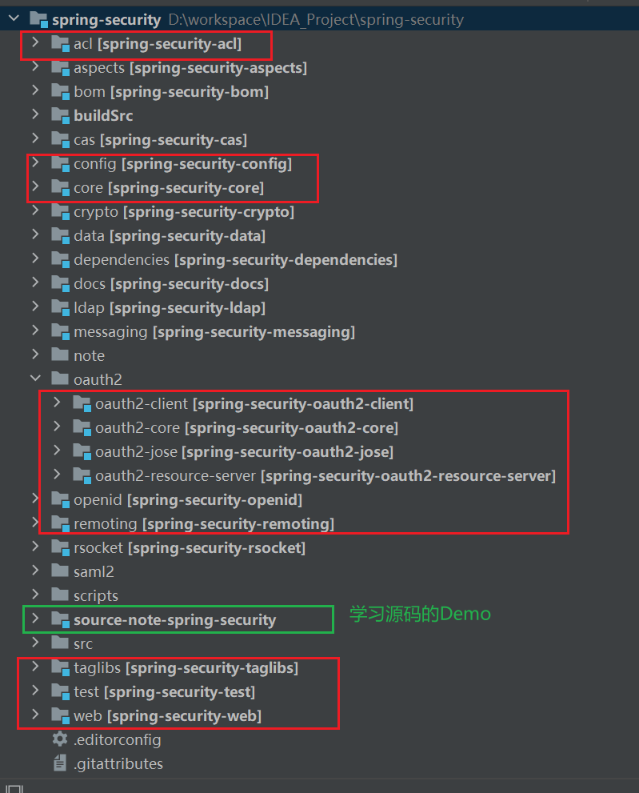

# 说明

Author: [haitaoss](https://github.com/haitaoss)

源码阅读仓库: [spring-security](https://github.com/haitaoss/spring-security)

参考资料和需要掌握的知识：

- [Spring Security 官方文档](https://docs.spring.io/spring-security/reference/5.8/)
- [官方示例代码：spring-security-samples](https://github.com/spring-projects/spring-security-samples/tree/5.8.x)
- [Spring 源码分析](https://github.com/haitaoss/spring-framework)

# Spring Security 介绍

Spring Security 是一个提供身份验证、授权和针对常见攻击的保护的框架。提供了对 Servlet 和 WebFlux 应用的支持。

Spring Security 通过使用标准 Servlet `Filter` 与 Servlet 容器集成。这意味着它适用于在 Servlet 容器中运行的任何应用程序。更具体地说，只要是 Servlet 应用程序就能使用 Spring Security，并不一定是 Spring 应用。

Spring Security 通过 `WebFilter` 实现对 Spring WebFlux  的支持。

**也就是说 Spring Security 只能在 Servlet应用 或 Spring WebFlux 应用中使用。**

## IDEA 编译运行源码

[IDEA 配置 Ajc 可以看这里](https://github.com/haitaoss/spring-framework/blob/source-v5.3.10/note/spring-source-note.md#aspectj-compiler-%E9%85%8D%E7%BD%AE)

## 项目模块和依赖项

### Core --- `spring-security-core.jar`

该模块包含核心身份验证和访问控制类和接口、远程处理支持和基本供应 API。任何使用 Spring Security 的应用程序都需要它。它支持独立应用程序、远程客户端、方法（服务层）安全和 JDBC 用户配置。

###  Remoting --- `spring-security-remoting.jar`

该模块提供与 Spring Remoting 的集成。你不需要这个，除非你正在编写一个使用 Spring Remoting 的远程客户端。

### Web --- `spring-security-web.jar`

该模块包含过滤器和相关的网络安全基础设施代码。它包含任何具有 servlet API 依赖性的东西。如果您需要 Spring Security Web 身份验证服务和基于 URL 的访问控制，则需要它。

###  Config --- `spring-security-config.ja`

该模块包含 security namespace 解析代码 和 Java 配置代码。如果您使用 Spring Security XML 命名空间进行配置或 Spring Security 的 Java 配置支持，则需要它。

###  LDAP --- `spring-security-ldap.jar`

> **Lightweight Directory Access Protocol** (轻量级目录访问协议 [LDAP](https://en.wikipedia.org/wiki/Lightweight_Directory_Access_Protocol)) 是一种开放的、供应商中立的行业标准应用程序协议，用于通过 Internet 协议 (IP) 网络访问和维护分布式目录信息服务。 [[1\]](https://en.wikipedia.org/wiki/Lightweight_Directory_Access_Protocol#cite_note-1) 目录服务在通过允许在整个网络中共享有关用户、系统、网络、服务和应用程序的信息来开发 Intranet 和 Internet 应用程序。 [[2\]](https://en.wikipedia.org/wiki/Lightweight_Directory_Access_Protocol#cite_note-2) 例如，目录服务可以提供任何有组织的记录集，通常具有层次结构，例如公司电子邮件目录。类似地，电话簿是具有地址和电话号码的订户列表。

此模块提供 LDAP 身份验证和配置代码。如果您需要使用 LDAP 身份验证或管理 LDAP 用户条目，则需要它。

### OAuth 2.0 Core --- `spring-security-oauth2-core.jar`

`spring-security-oauth2-core.jar` 包含为 OAuth 2.0 授权框架和 OpenID Connect Core 1.0 提供支持的核心类和接口。使用 OAuth 2.0 或 OpenID Connect Core 1.0 的应用程序需要它，例如客户端、资源服务器和授权服务器。

###  OAuth 2.0 Client --- `spring-security-oauth2-client.jar`

`spring-security-oauth2-client.jar` 包含 Spring Security 对 OAuth 2.0 授权框架和 OpenID Connect Core 1.0 的客户端支持。使用 OAuth 2.0 登录或 OAuth 客户端支持的应用程序需要它。

### OAuth 2.0 JOSE --- `spring-security-oauth2-jose.jar`

`spring-security-oauth2-jose.jar` 包含 Spring Security 对 JOSE（Javascript 对象签名和加密）框架的支持。 JOSE 框架旨在提供一种在各方之间安全地转移索赔的方法。它是根据一系列规范构建的：

- JSON Web Token (JWT)
- JSON Web Signature (JWS)
- JSON Web Encryption (JWE)
- JSON Web Key (JWK) JSON

### OAuth 2.0 Resource Server --- `spring-security-oauth2-resource-server.jar`

`spring-security-oauth2-resource-server.jar` 包含 Spring Security 对 OAuth 2.0 资源服务器的支持。它用于通过 OAuth 2.0 Bearer Tokens 保护 API。

###  ACL --- `spring-security-acl.jar`

该模块包含专门的域对象 ACL 实现。它用于将安全性应用于应用程序中的特定域对象实例。

###  CAS --- `spring-security-cas.jar`

Central Authentication Server (CAS)：中央认证服务器

此模块包含 OpenID Web 身份验证支持。它用于根据外部 OpenID 服务器对用户进行身份验证。

### Test --- `spring-security-test.jar`

此模块包含对使用 Spring Security 进行测试的支持。

###  Taglibs --- `spring-secuity-taglibs.jar`

提供 Spring Security 的 JSP 标签实现。

# 核心源码

这是基于Servlet应用的场景分析 Spring Security 的源码

Principal：主角、当事人、委托人

GrantedAuthority：授权机构

credentials：资格证书

Explicit：明确的、清楚的

restrict：限制、限定

commence：开始

entryPoint：入口点

permit：允许

attempt：参数

decide：决定

erase：清除

AccessDecisionManager：访问决策管理器